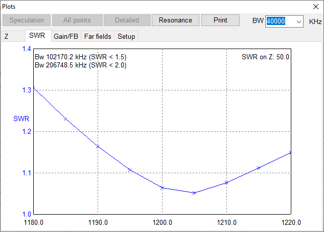

# directional-antenna-in-mmana-gal
# Дослідження директорної антени в програмі MMANA-GAL

Завантажити програму можна за посиланням: [MMANA-GAL](https://cxem.net/software/mmana.php)

Дані для створення антени були взяті з сайту: [Моделирование директорной антенны в программе MMANA](https://studme.org/196607/tehnika/modelirovanie_direktornoy_antenny_programme_mmana)

### Створена атена:

### Параметри провідників антени:

### Результати обчислень:

### Діаграма напрямленості:

### Залежність вхідного опору від частоти:

### Залежність КСХ від частоти:

### Залежність GAIN/FB від частоти:

### Діаграма напрямленості:

